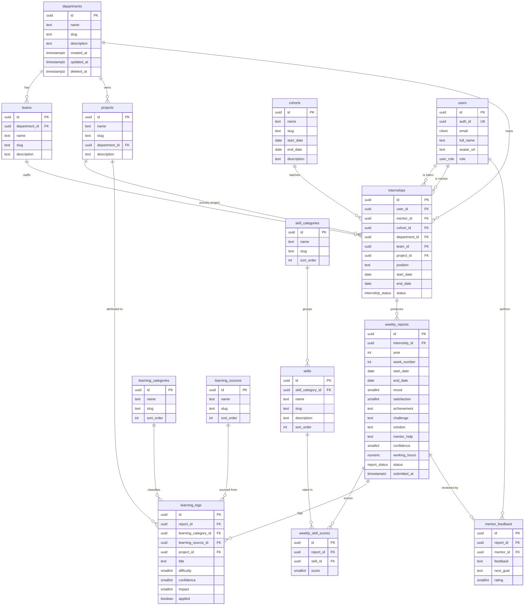

# Altiora — Database Design

Internship Intelligence Platform · Callour Studio
Target: PostgreSQL 15+ (Supabase). Authoritative DDL: [`supabase/schema.sql`](../supabase/schema.sql).

---

## Overview

Altiora models the **internship lifecycle** and turns weekly self-reflection into
organizational insight. The design is deliberately hub-and-spoke:

- **Lookup/master tables** (`departments`, `teams`, `cohorts`, `projects`,
  `skill_categories`, `skills`, `learning_categories`, `learning_sources`)
  describe the org's analytics dimensions. The organization manages these over
  time.
- **`users`** is identity — a mirror of `auth.users` enriched with an app role.
- **`internships`** is the analytics hub. One row per intern-per-engagement,
  binding the intern to a mentor, cohort, department, team, project, position,
  duration, and status.
- **`weekly_reports`** anchor to an `internship_id` (never a bare `user_id`), so
  every report inherits the full org context of its internship.
- **`weekly_skill_scores`, `learning_logs`, `mentor_feedback`** are children of a
  report — the quantitative, qualitative, and supervisory layers of each week.

Everything reportable hangs off `internships`, which is what makes cross-cutting
analytics (by mentor, cohort, department, project, source) a set of joins rather
than a schema redesign.

---

## Entity-Relationship Diagram

> Note: `users` participates in `internships` twice — once as `user_id` (the
> intern) and once as `mentor_id` (the assigned mentor). Both are FKs to
> `public.users(id)`.

---

## Relationships explained

**`internships` is the analytics hub.** A single internship row binds together
every dimension the product needs to slice on:

- `user_id` → the intern (`on delete cascade`).
- `mentor_id` → the assigned mentor (`on delete set null`).
- `cohort_id`, `department_id`, `team_id`, `project_id` → org context
  (all `on delete set null`, so lookup churn never destroys history).
- `position`, `start_date`, `end_date`, `status` → the engagement itself.

Because every reportable fact references an internship, questions like "how did
mentor X's interns grow" or "which cohort submitted most consistently" are joins
through this one table rather than denormalized copies scattered across children.

**`weekly_reports` anchor to `internship_id`, not `user_id`.** This is the
load-bearing decision. A report does not merely belong to a person — it belongs
to a _specific engagement_. Through `internship_id` a report transitively knows
its mentor, cohort, department, team, project, and duration. A person can hold
more than one internship (re-engagement, a second cohort) and each keeps its own
report stream with the correct context. The partial unique index
`weekly_reports (internship_id, year, week_number) where deleted_at is null`
enforces one live report per ISO week per engagement.

**Report → children.** Each `weekly_reports` row fans out to:

- **`weekly_skill_scores`** — 0..N rows, one per skill rated that week
  (`score` 1..5). Unique on `(report_id, skill_id)`.
- **`learning_logs`** — 0..N rows, the intelligence layer: what was learned,
  from which `learning_source_id`, in which `learning_category_id`, optionally
  attributed to a `project_id`, with `difficulty`/`confidence`/`impact` (1..5)
  and an `applied` flag.
- **`mentor_feedback`** — 0..1 rows (partial unique on `report_id`): the
  mentor's `feedback`, `next_goal`, and `rating` (1..5).

All three cascade-delete with their parent report, and reports cascade-delete
with their internship.

---

## Why every table exists

| Table                 | Purpose                                                  | Capability it unlocks                                                                    |
| --------------------- | -------------------------------------------------------- | ---------------------------------------------------------------------------------------- |
| `departments`         | Top-level org unit.                                      | Group internships and projects for department-level outcome analysis.                    |
| `teams`               | Sub-unit of a department (`department_id`).              | Finer-grained placement and team-level comparisons.                                      |
| `cohorts`             | Internship batch with `start_date`/`end_date`.           | Cohort-over-cohort performance and consistency analytics.                                |
| `projects`            | Work an intern is assigned to; optional `department_id`. | Attribute learning and growth to the work that produced it.                              |
| `skill_categories`    | Grouping + `sort_order` for skills.                      | Roll skill scores up to competency areas; stable UI ordering.                            |
| `skills`              | The rated skills (`skill_category_id`).                  | The vocabulary for `weekly_skill_scores`; per-skill growth curves.                       |
| `learning_categories` | Classification of learning (`sort_order`).               | Segment what kinds of learning happen and where.                                         |
| `learning_sources`    | Where learning came from.                                | Measure which sources are most effective.                                                |
| `users`               | Identity mirror of `auth.users` + app `role`.            | Auth, RLS subject, mentor/intern relationships.                                          |
| `internships`         | One intern-per-engagement; the hub.                      | Binds intern→mentor/cohort/dept/team/project/duration; the join spine for all analytics. |
| `weekly_reports`      | One report per internship per ISO week.                  | The reflection unit; carries mood/satisfaction/confidence/hours + narrative.             |
| `weekly_skill_scores` | Per-skill 1..5 rating within a report.                   | Quantitative skill trajectories over time.                                               |
| `learning_logs`       | First-class learning records within a report.            | The intelligence layer: source/category/project effectiveness, applied-rate.             |
| `mentor_feedback`     | Mentor's response to a report (0..1).                    | Supervisory signal; links mentor input to subsequent growth.                             |

---

## Conventions

- **UUID primary keys** — `id uuid primary key default gen_random_uuid()`
  (via the `pgcrypto` extension). No sequential leakage; safe to mint client-side.
- **UTC timestamps** — every temporal column is `timestamptz`, stored in UTC.
  ISO dates (`start_date`, `end_date`) are `date`.
- **`created_at` + `updated_at` everywhere** — both `timestamptz not null
default now()`. `updated_at` is maintained by the shared
  `public.set_updated_at()` trigger, attached to all 14 tables via a
  `before update ... for each row` trigger loop.
- **`deleted_at` soft delete** — present on all mutable domain tables. The one
  exception is `weekly_skill_scores`, which has no `deleted_at` (scores are
  replaced wholesale per report, not individually retired). Rows are never hard-
  deleted through the app; queries filter `where deleted_at is null`.
- **Partial unique indexes `where deleted_at is null`** — uniqueness applies to
  _live_ rows only, so a soft-deleted slug/period can be reused. Examples:
  `departments_slug_key`, `teams_dept_slug_key`, `cohorts_slug_key`,
  `projects_slug_key`, `skill_categories_slug_key`, `skills_slug_key`,
  `learning_categories_slug_key`, `learning_sources_slug_key`, `users_email_key`,
  `weekly_reports_period_key`, `mentor_feedback_report_key`.
  (`weekly_skill_scores_key` on `(report_id, skill_id)` is unconditional — no soft
  delete on that table.)
- **`citext` for email** — case-insensitive uniqueness on `users.email`.
- **Enums for stable value sets only** — `user_role`, `internship_status`,
  `report_status`. See ADR-0002 and ADR-0003.
- **Indexing strategy** — every FK used in a filter or join is indexed. Hot RLS
  paths (`internships.user_id`, `internships.mentor_id`) are partial indexes on
  live rows. Hot query paths carry dedicated indexes:
  `weekly_reports_period_idx (year, week_number)`,
  `weekly_reports_status_idx`, `learning_logs_applied_idx`,
  `internships_status_idx`, `users_role_idx`.

---

## Row Level Security model

RLS is enabled on **all 14 tables**. Access resolves by app role:

- **admin** — full access to everything (`is_admin()` on `for all`).
- **mentor** — read access limited to interns assigned via
  `internships.mentor_id`; may write `mentor_feedback` on their interns' reports.
- **intern** — access limited to their own data via `internships.user_id`;
  interns create/update/delete their own reports and children.
- **lookup tables** — any authenticated user may `select`; only admins may write.

### SECURITY DEFINER helper functions

Policies delegate to a small set of helpers. They are `SECURITY DEFINER` so they
can read `public.users` even though `public.users` is itself under RLS —
otherwise a policy that needs "the current user's role" would recurse into the
users policy. Keeping the logic in `stable` functions also lets the planner cache
per-statement results and keeps each policy expression short and fast.

| Function                    | Returns     | Role                                                                                                                                                            |
| --------------------------- | ----------- | --------------------------------------------------------------------------------------------------------------------------------------------------------------- |
| `current_app_user_id()`     | `uuid`      | Maps `auth.uid()` → `public.users.id` for the live user.                                                                                                        |
| `current_app_role()`        | `user_role` | The current user's app role.                                                                                                                                    |
| `is_admin()`                | `boolean`   | `current_app_role() = 'admin'`; the admin gate on every table.                                                                                                  |
| `owns_report(report_id)`    | `boolean`   | True if the report's internship `user_id` is the current user — the intern write predicate for `weekly_skill_scores`, `learning_logs`, `mentor_feedback` reads. |
| `mentors_report(report_id)` | `boolean`   | True if the report's internship `mentor_id` is the current user — the mentor read/write predicate on report children.                                           |

`owns_report` / `mentors_report` join `weekly_reports → internships` once and are
reused across the child-table policies, so the ownership rule lives in exactly one
place. `is_admin()` is `stable` (not `security definer` itself) but calls the
definer function `current_app_role()`.

---

## Analytics the model enables

| Question                                         | Tables / joins                                                                               | Key columns                                                                                  |
| ------------------------------------------------ | -------------------------------------------------------------------------------------------- | -------------------------------------------------------------------------------------------- |
| Which projects generate the most learning?       | `learning_logs.project_id` → `projects` (also via `internships.project_id`)                  | `count(learning_logs.*)`, `impact`, `applied` grouped by `project_id`                        |
| Which mentors produce the highest growth?        | `internships.mentor_id` → `weekly_reports` → `weekly_skill_scores`                           | Δ `score` over `year, week_number` per `mentor_id`; cross-check `mentor_feedback.rating`     |
| When does motivation dip during an internship?   | `internships` → `weekly_reports`                                                             | `mood`, `satisfaction`, `confidence` vs. `week_number` (relative to `start_date`/`end_date`) |
| Which skills improve fastest?                    | `weekly_skill_scores` → `skills` → `skill_categories`; ordered by report `year, week_number` | slope of `score` per `skill_id`                                                              |
| Most common challenges?                          | `weekly_reports`                                                                             | text-mine/tag `challenge` (and `solution`)                                                   |
| Which cohort performs best?                      | `internships.cohort_id` → `cohorts`; join `weekly_reports` + children                        | submission rate, avg `satisfaction`/`confidence`, skill deltas per `cohort_id`               |
| Which departments create the strongest outcomes? | `internships.department_id` → `departments`                                                  | aggregate skill growth, `applied` rate, feedback `rating` per `department_id`                |
| Which learning sources are most effective?       | `learning_logs.learning_source_id` → `learning_sources`                                      | `avg(impact)`, `applied` rate, `avg(confidence)` per `learning_source_id`                    |

All of the above route through `internships`, which is why adding a new slicing
dimension is a join, not a migration of the fact tables.

---

## Scalability considerations

- **Partial indexes** — `where deleted_at is null` keeps the hot indexes lean;
  soft-deleted rows do not bloat the working set that RLS and dashboards scan.
- **Range-partitioning `weekly_reports` by `year`** — reports are the highest-
  growth table (interns × weeks). `year` is already a first-class column, so
  declarative range partitioning by `year` is a drop-in later: recent-year
  partitions stay hot, old years archive cheaply. Children
  (`weekly_skill_scores`, `learning_logs`, `mentor_feedback`) can follow via their
  `report_id` FK or partition alongside.
- **Materialized views for heavy analytics** — cohort/mentor/department roll-ups
  (skill slopes, submission rates, source effectiveness) are expensive multi-join
  aggregates. Precompute them as materialized views refreshed on a schedule; the
  dashboards read the view, not the fact tables.
- **RLS performance** — the intern/mentor predicates hit
  `internships.user_id` and `internships.mentor_id` on every row; both have
  partial indexes on live rows. The `stable` `SECURITY DEFINER` helpers let the
  planner evaluate the subject once per statement rather than per row.
- **Read-model / denormalization** — `types/domain.ts` already defines composite
  read models (`WeeklyReportDetail`, `InternSummary`). If join cost becomes the
  bottleneck, these map naturally onto materialized views or a denormalized
  summary table (e.g. an `intern_summary` refreshed on report submit) without
  touching the normalized source of truth.
- **Connection pooling** — Supabase fronts Postgres with PgBouncer; the app uses
  transaction-mode pooling for serverless (Next.js Server Actions / RSC), which
  keeps connection count bounded under bursty request patterns.
